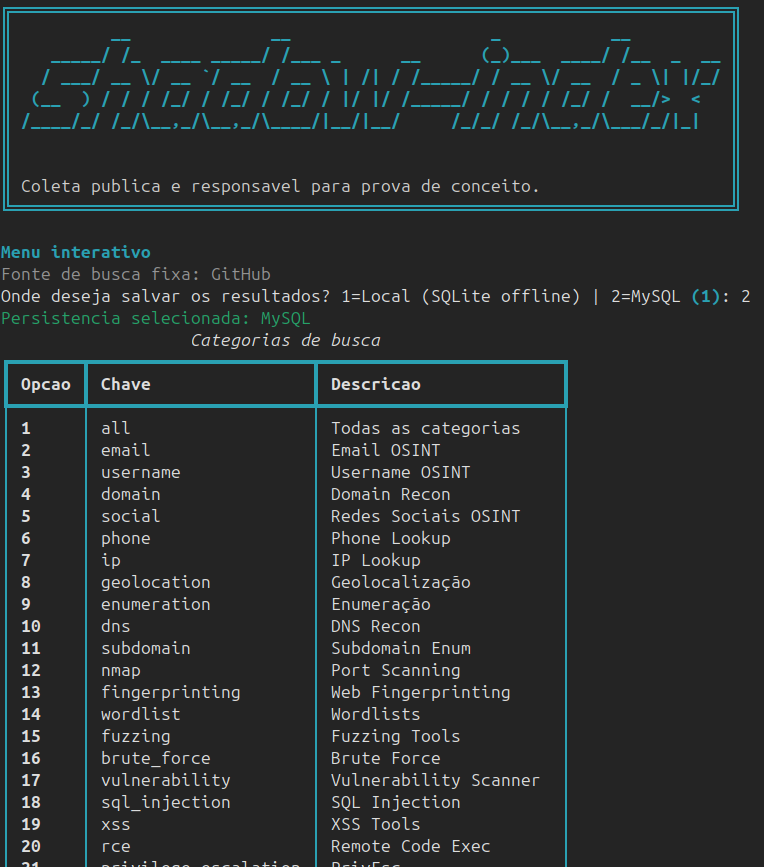

# Shadow-Index

## Preview

<p align="center">
	
</p>

Shadow-Index e uma aplicacao em Python para varrer repositorios publicos do GitHub relacionados a OSINT e seguranca, deduplicar os resultados e persistir os dados em MySQL.

O fluxo principal desta aplicacao e:

1. carregar as credenciais do ambiente;
2. conectar no MySQL;
3. criar as tabelas se elas ainda nao existirem;
4. abrir um menu interativo para definir a varredura;
5. coletar repositorios publicos do GitHub;
6. salvar as ferramentas encontradas no banco;
7. registrar a execucao na tabela de varreduras;
8. gerar um relatorio HTML em exports/osint_report.html.

## O que a aplicacao faz

- Busca repositorios publicos no GitHub a partir de categorias e palavras-chave.
- Coleta nome do repositorio, URL, descricao, linguagem, stars e topicos.
- Evita duplicatas em memoria durante a execucao.
- Evita duplicatas no banco antes de inserir um novo registro.
- Registra estatisticas da execucao ao final da varredura.
- Gera um relatorio HTML com o resumo dos resultados.

## Requisitos

- Windows 10/11, Linux ou macOS.
- Python 3.10 ou superior.
- MySQL 5.7 ou superior.
- Git instalado.
- Terminal compatível com o seu sistema.

## Passo a passo completo

### 1. Clonar o repositorio

Substitua <URL_DO_REPOSITORIO> pela URL real do repositorio.

Windows PowerShell:

```powershell
git clone <URL_DO_REPOSITORIO>
cd shadow-index
```

Linux:

```bash
git clone <URL_DO_REPOSITORIO>
cd shadow-index
```

macOS:

```bash
git clone <URL_DO_REPOSITORIO>
cd shadow-index
```

### 2. Criar e ativar um ambiente virtual

Windows PowerShell:

```powershell
py -3 -m venv .venv
.\.venv\Scripts\Activate.ps1
```

Se o PowerShell bloquear a ativacao por politica de execucao, rode uma vez no usuario atual:

```powershell
Set-ExecutionPolicy -ExecutionPolicy RemoteSigned -Scope CurrentUser
```

Linux:

```bash
python3 -m venv .venv
source .venv/bin/activate
```

macOS:

```bash
python3 -m venv .venv
source .venv/bin/activate
```

Conferir a versao do Python:

Windows PowerShell:

```powershell
py -3 --version
```

Linux e macOS:

```bash
python3 --version
```

### 3. Instalar as dependencias do projeto

Windows PowerShell:

```powershell
python -m pip install --upgrade pip
pip install -r requirements.txt
```

Linux:

```bash
python3 -m pip install --upgrade pip
pip install -r requirements.txt
```

macOS:

```bash
python3 -m pip install --upgrade pip
pip install -r requirements.txt
```

As principais dependencias instaladas sao:

- aiohttp
- beautifulsoup4
- mysql-connector-python
- python-dotenv
- rich
- pyfiglet
- loguru
- numpy
- scikit-learn
- sentence-transformers
- lxml

### 4. Criar o banco de dados no MySQL

A aplicacao cria as tabelas automaticamente, mas nao cria o banco. Por isso, o banco precisa existir antes da primeira execucao.

Entre no MySQL:

Windows PowerShell, Linux ou macOS:

```bash
mysql -u root -p
```

Depois crie o banco:

```sql
CREATE DATABASE osint_tools CHARACTER SET utf8mb4 COLLATE utf8mb4_unicode_ci;
```

Se preferir, crie tambem um usuario dedicado e conceda permissoes:

```sql
CREATE USER 'osint_user'@'localhost' IDENTIFIED BY 'troque_por_uma_senha_forte';
GRANT ALL PRIVILEGES ON osint_tools.* TO 'osint_user'@'localhost';
FLUSH PRIVILEGES;
```

### 5. Configurar o arquivo .env

Copie o arquivo de exemplo.

Windows PowerShell:

```powershell
Copy-Item .env.example .env
```

Linux:

```bash
cp .env.example .env
```

macOS:

```bash
cp .env.example .env
```

Edite o arquivo .env e preencha os valores corretos:

```env
GITHUB_TOKEN=

DB_HOST=localhost
DB_USER=osint_user
DB_PASSWORD=troque_por_uma_senha_forte
DB_NAME=osint_tools
DB_PORT=3306
```

Observacoes importantes:

- GITHUB_TOKEN e opcional, mas recomendado para reduzir bloqueios e limites severos do GitHub.
- DB_PORT existe no .env.example, mas a conexao atual usa host, usuario, senha e nome do banco. Mantenha o valor por organizacao do ambiente, mesmo que ele nao seja consumido diretamente pelo codigo neste momento.

### 6. Executar a aplicacao

Com o ambiente virtual ativo, rode:

Windows PowerShell:

```powershell
python app.py
```

Linux:

```bash
python3 app.py
```

macOS:

```bash
python3 app.py
```

### 7. Preencher o menu interativo

Durante a execucao, a aplicacao vai pedir as configuracoes da varredura. O fluxo esperado e este:

1. Fonte de busca: fixa em GitHub (nao precisa informar).
2. Persistencia dos dados: escolher onde salvar (1=Local SQLite offline, 2=MySQL).
3. Categoria: escolher a categoria numerica desejada.
4. Assistente de palavras-chave: escolher se quer abrir um painel para adicionar termos extras de busca.
5. Tema adicional opcional: informar um contexto complementar (ex: phishing, malware, forense) ou pressionar Enter para ignorar.
6. Ate qual pagina cada busca pode ir: valor de 1 a 20; controla a profundidade (mais alto = mais resultados e mais tempo). Se voce apertar enter sem ter digitado, o valor de pagina sera 8 por padrao.
7. Paginas aleatorias por busca: em cada query, o sistema sorteia um valor desta lista para definir quantas paginas ira varrer (ex: 1,2,3). Se voce apertar enter sem ter digitado, sera usado 1,2,3 por padrao.
8. Maximo de requisicoes por minuto: controla a velocidade (menor valor reduz risco de bloqueio). Se pressionar Enter, usa 15.
9. Intervalo minimo e maximo entre requisicoes: define a pausa em segundos entre uma chamada e outra. Se pressionar Enter, usa 1.2 e 3.0.

Configuracao inicial segura para primeira execucao:

- Ate qual pagina cada busca pode ir: 5
- Paginas aleatorias por busca: 1,2,3
- Maximo de requisicoes por minuto: 10
- Intervalo minimo: 1.2
- Intervalo maximo: 3.0

### 8. Acompanhar a varredura

Durante a coleta, a aplicacao mostra no terminal:

- o andamento das queries;
- mensagens de ferramenta nova salva;
- mensagens de ferramenta ja existente;
- resumo final da execucao.

Se a conexao com o MySQL estiver correta, a aplicacao informara no inicio que o banco esta conectado e pronto.

### 9. Identificar o fim da varredura

Uma varredura so esta concluida quando estes eventos ja tiverem acontecido:

1. todas as queries forem processadas;
2. o painel Resumo da execucao aparecer no terminal;
3. o registro da execucao for salvo na tabela varreduras;
4. o relatorio exports/osint_report.html for gerado;
5. a conexao com o banco for encerrada ao final do processo.

Se o banco estiver conectado, o resumo final tambem mostrara:

- Ferramentas novas
- Duplicatas detectadas
- Estatisticas do banco

### 10. Confirmar que os dados foram gravados no banco

Depois que a execucao terminar, voce pode validar no MySQL.

Windows PowerShell, Linux ou macOS:

```bash
mysql -u osint_user -p osint_tools
```

Consultar as ultimas ferramentas salvas:

```sql
SELECT id, nome, url, linguagem, stars, categoria, query, data_insercao
FROM ferramentas
ORDER BY id DESC
LIMIT 10;
```

Consultar as ultimas varreduras registradas:

```sql
SELECT id, categoria, quantidade_encontradas, quantidade_novas, quantidade_duplicadas, tempo_execucao_segundos, data_varredura
FROM varreduras
ORDER BY id DESC
LIMIT 10;
```

Se essas consultas retornarem registros recentes, a varredura terminou corretamente e os dados ja estao persistidos.

## Estrutura resumida do projeto

- app.py: fluxo principal da aplicacao.
- collectors/github_collector.py: coleta de repositorios publicos do GitHub.
- modulo/menu.py: menu interativo para montar a varredura.
- modulo/filters.py: categorias e queries base.
- modulo/database.py: conexao, criacao de tabelas e persistencia MySQL.
- modulo/report.py: geracao do relatorio HTML.

## Como funciona a persistencia

Ao iniciar, a aplicacao tenta se conectar ao banco configurado no .env.

Se a conexao funcionar:

- cria as tabelas ferramentas e varreduras, caso ainda nao existam;
- salva cada repositorio novo na tabela ferramentas;
- evita inserir registros repetidos por nome ou URL;
- registra o resumo da execucao na tabela varreduras.

Se a conexao com MySQL falhar:

- a busca continua normalmente;
- o sistema ativa automaticamente um banco offline SQLite em offline/osint_tools.sqlite3;
- os repositorios encontrados e o historico de varreduras continuam sendo persistidos localmente;
- voce vera um aviso no terminal informando que o modo offline foi ativado.

## Saidas geradas

- exports/osint_report.html com o relatorio da execucao.
- Resumo no terminal com quantidade encontrada, duplicadas, erros e tempo total.
- Registros persistidos no MySQL quando disponivel.
- Fallback automatico para SQLite em offline/osint_tools.sqlite3 quando o MySQL estiver indisponivel.

## Politica de conscientizacao e uso responsavel

Esta aplicacao deve ser usada com responsabilidade, finalidade legitima e respeito a limites tecnicos, legais e eticos.

### Objetivo permitido

Esta ferramenta foi desenhada para pesquisa, catalogacao, organizacao e analise de repositorios publicos relacionados a seguranca, OSINT e tecnologia.

Usos aceitaveis incluem:

- pesquisa academica;
- inventario de ferramentas publicas;
- monitoramento de ecossistemas open source;
- estudos de threat intelligence com fontes abertas;
- organizacao interna de referencias tecnicas.

### Regras de uso

- Varra apenas conteudos publicamente acessiveis.
- Respeite os termos de uso do GitHub e os limites de requisicao.
- Nao use os resultados para atacar, explorar ou causar indisponibilidade em sistemas de terceiros.
- Nao associe automaticamente um repositorio encontrado a intencao maliciosa de seus autores.
- Nao publique credenciais, tokens ou dumps de banco em repositorios ou capturas de tela.
- Mantenha o token do GitHub e as credenciais do MySQL fora do controle de versao.

### Cuidados operacionais

- Use um usuario de banco com privilegios apenas sobre a base da aplicacao.
- Proteja o arquivo .env e nao o compartilhe.
- Revise periodicamente os dados coletados antes de qualquer redistribuicao.
- Considere que descricoes, topicos e classificacoes podem conter ruido ou falsos positivos.
- Ajuste limites de requisicao e delays para evitar comportamento agressivo contra o GitHub.

### Responsabilidade do operador

Quem executa a aplicacao e responsavel por:

- verificar a conformidade legal da coleta no seu contexto;
- definir credenciais seguras;
- controlar quem pode acessar o banco gerado;
- validar os dados antes de transformar a base em inteligencia acionavel.

## Observacoes finais

- No Windows, execute preferencialmente pelo PowerShell para evitar diferencas de comandos do cmd.
- No macOS, se o comando python3 nao existir, instale o Python mais recente antes de criar o ambiente virtual.
- No Linux, se o modulo venv nao estiver disponivel, instale o pacote da sua distribuicao correspondente ao python3-venv.
- O GitHub pode responder com 403 ou 429 em execucoes intensas.
- O uso de token melhora a estabilidade da coleta.
- A aplicacao trabalha com deduplicacao em memoria e no banco.
- Para a primeira validacao, prefira uma varredura curta e confirme os registros no MySQL antes de aumentar a profundidade.
